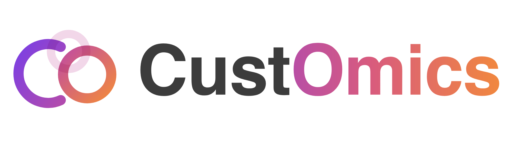
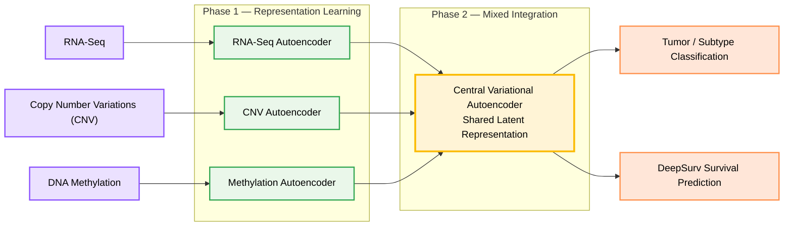

# A versatile deep-learning based strategy for multi-omics integration

  

A Python package for integrating multiple genomic data modalities (e.g., RNA-seq, CNV, and DNA methylation) using a hierarchical deep-learning architecture. It supports classification, survival outcome prediction, and SHAP-based explainability, all in a single scikit-learn-style API.

## Overview

CustOmics is designed to provide a modern and research-friendly framework for computational biology and precision medicine.

It relies on [`mudata`](https://mudata.readthedocs.io/stable/), a core [scverse](https://scverse.org/) data structure for multimodal data.

## Architecture

At the core of Customics is a two-phase mixed-integration workflow:

- **Phase 1** trains per-source autoencoders jointly with the task heads.
- **Phase 2** additionally trains the central VAE to consolidate the integrated representation.

## Why use CustOmics

`CustOmics` is built for high-dimensional and heterogeneous omics datasets.

### 1. Unified API

- Classification tasks
- Survival outcome prediction
- Latent representation learning
- SHAP-based explainability
- Modular source-specific autoencoders for flexible experimentation
- Scalable training using PyTorch and GPU acceleration
- Compatible with scikit-learn-style workflows

### 2. Visualization Utilities

- Latent space exploration
- Kaplan-Meier survival stratification
- Feature attribution analysis
- Easily extensible to custom architectures, tasks, and omics sources

Start using CustOmics by reading the [getting started](getting_started) guide.
