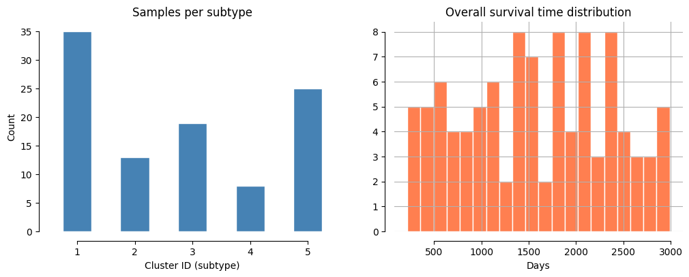
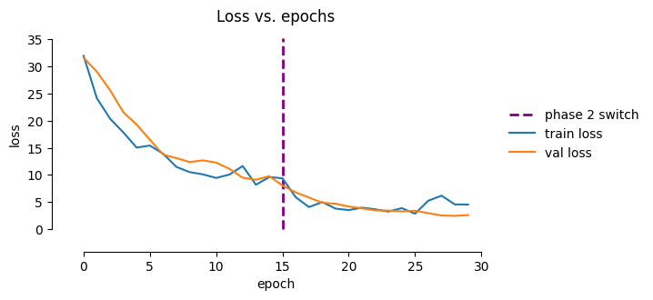
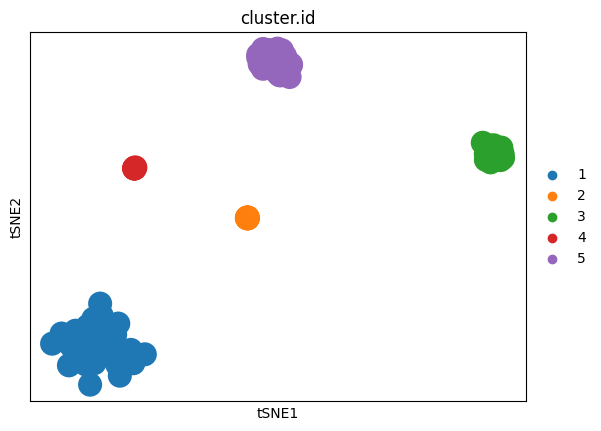
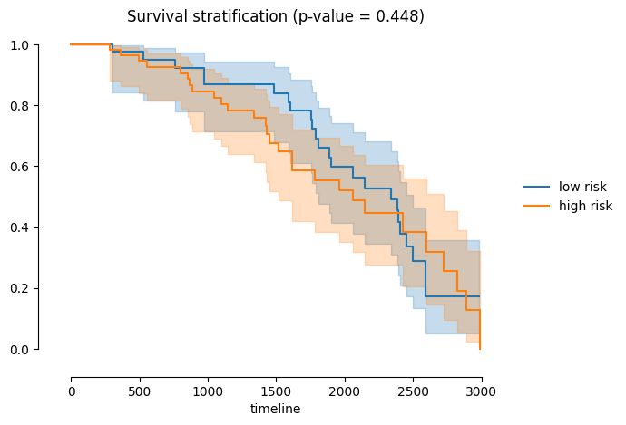
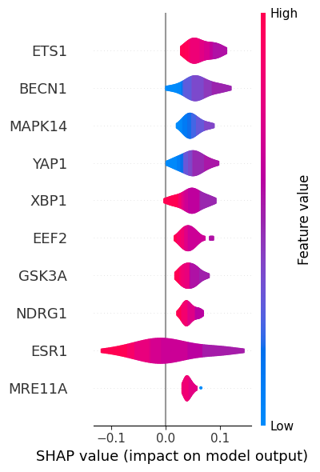
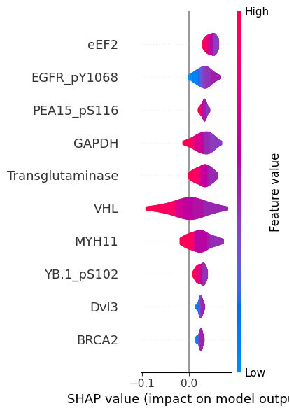
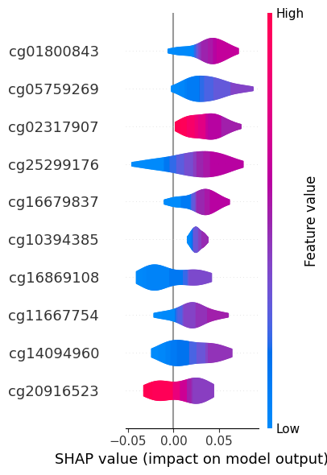

# Main usage

This notebook walks through a complete **customics** workflow on a demo dataset.


```python
import customics
from customics import CustOMICS
```

## Data preparation

### Data loading

`customics` is built on top of [`mudata.MuData`](https://mudata.readthedocs.io/stable/), which is a convenient data structure for multimodal objects.

For the sake of this tutorial, you can load a toy dataset with [`toy_dataset`][customics.toy_dataset]:


```python
mdata = customics.toy_dataset()
```

    /Users/alihamraoui/projects/tests/CustOmics/.venv/lib/python3.12/site-packages/mudata/_core/mudata.py:1416: UserWarning: var_names are not unique. To make them unique, call `.var_names_make_unique`.
      self._update_attr("var", axis=0, join_common=join_common)


As shown below, we have 100 patients across 3 modalities:

1. RNA-seq gene expression
2. Reverse Phase Protein Array (RPPA)
3. DNA methylation


```python
mdata
```


<pre>MuData object with n_obs × n_vars = 100 × 658
  obs:	&#x27;subjects&#x27;, &#x27;cluster.id&#x27;, &#x27;OS&#x27;, &#x27;OS.time&#x27;
  3 modalities
    rna:	100 × 131
    protein:	100 × 160
    methyl:	100 × 367</pre>


For instance, we can access the protein modality as below.

> Note that `mdata["protein"]` is an [`AnnData`](https://anndata.readthedocs.io/en/latest/) object.


```python
mdata["protein"].to_df().head()
```


<div>
<style scoped>
    .dataframe tbody tr th:only-of-type {
        vertical-align: middle;
    }

    .dataframe tbody tr th {
        vertical-align: top;
    }

    .dataframe thead th {
        text-align: right;
    }
</style>
<table border="1" class="dataframe">
  <thead>
    <tr style="text-align: right;">
      <th>probe</th>
      <th>ACC1</th>
      <th>ACC_pS79</th>
      <th>ACVRL1</th>
      <th>Akt_pS473</th>
      <th>PRAS40_pT246</th>
      <th>Annexin.1</th>
      <th>AR</th>
      <th>A.Raf_pS299</th>
      <th>ASNS</th>
      <th>ATM</th>
      <th>...</th>
      <th>XBP1</th>
      <th>XRCC1</th>
      <th>Ku80</th>
      <th>YAP</th>
      <th>YAP_pS127</th>
      <th>YB.1</th>
      <th>YB.1_pS102</th>
      <th>14.3.3_beta</th>
      <th>14.3.3_epsilon</th>
      <th>14.3.3_zeta</th>
    </tr>
  </thead>
  <tbody>
    <tr>
      <th>subject1</th>
      <td>-0.528421</td>
      <td>-0.826949</td>
      <td>2.465380</td>
      <td>0.118108</td>
      <td>2.682673</td>
      <td>-0.473918</td>
      <td>2.692947</td>
      <td>0.392130</td>
      <td>-1.458304</td>
      <td>-0.518608</td>
      <td>...</td>
      <td>2.365702</td>
      <td>-0.115504</td>
      <td>2.125662</td>
      <td>0.198529</td>
      <td>0.263075</td>
      <td>2.035369</td>
      <td>3.276020</td>
      <td>-0.164232</td>
      <td>2.240264</td>
      <td>0.390613</td>
    </tr>
    <tr>
      <th>subject2</th>
      <td>-0.804377</td>
      <td>-0.858630</td>
      <td>2.679618</td>
      <td>1.163897</td>
      <td>2.789568</td>
      <td>0.326823</td>
      <td>3.703054</td>
      <td>-0.207030</td>
      <td>-0.567368</td>
      <td>-1.447359</td>
      <td>...</td>
      <td>2.369684</td>
      <td>-0.250648</td>
      <td>2.028639</td>
      <td>0.294427</td>
      <td>0.087710</td>
      <td>2.748533</td>
      <td>2.655492</td>
      <td>-0.020322</td>
      <td>2.584052</td>
      <td>1.083867</td>
    </tr>
    <tr>
      <th>subject3</th>
      <td>0.596001</td>
      <td>0.175652</td>
      <td>2.782368</td>
      <td>-1.550062</td>
      <td>2.136330</td>
      <td>-0.729363</td>
      <td>3.987616</td>
      <td>-0.065740</td>
      <td>0.225819</td>
      <td>0.321197</td>
      <td>...</td>
      <td>2.912468</td>
      <td>0.235292</td>
      <td>3.102378</td>
      <td>0.717648</td>
      <td>0.118142</td>
      <td>2.608048</td>
      <td>1.894032</td>
      <td>0.423970</td>
      <td>2.470960</td>
      <td>0.355451</td>
    </tr>
    <tr>
      <th>subject4</th>
      <td>2.306769</td>
      <td>2.387911</td>
      <td>2.152993</td>
      <td>0.175379</td>
      <td>-0.243862</td>
      <td>0.206090</td>
      <td>3.851968</td>
      <td>-0.347185</td>
      <td>1.595250</td>
      <td>2.998184</td>
      <td>...</td>
      <td>0.019668</td>
      <td>2.319597</td>
      <td>0.211079</td>
      <td>0.178415</td>
      <td>0.312633</td>
      <td>-0.205992</td>
      <td>0.151597</td>
      <td>2.289823</td>
      <td>0.153826</td>
      <td>-0.634842</td>
    </tr>
    <tr>
      <th>subject5</th>
      <td>-0.948945</td>
      <td>-0.640623</td>
      <td>2.242055</td>
      <td>0.829983</td>
      <td>2.732090</td>
      <td>-0.218177</td>
      <td>2.376110</td>
      <td>-0.510938</td>
      <td>-1.030711</td>
      <td>-0.125802</td>
      <td>...</td>
      <td>2.169958</td>
      <td>-0.044484</td>
      <td>2.905596</td>
      <td>0.539468</td>
      <td>0.338059</td>
      <td>2.257715</td>
      <td>2.718098</td>
      <td>-0.190475</td>
      <td>2.523407</td>
      <td>0.445861</td>
    </tr>
  </tbody>
</table>
<p>5 rows × 160 columns</p>
</div>


### Register clinical columns

`mdata.obs` is a DataFrame whose index are sample IDs, and contains the following columns:

- an event-indicator (`OS`, 0 = censored, 1 = event)
- a survival-time column (`OS.time`, in days).
- **tumour subtype label** (`cluster.id`, classes 1–5)


```python
mdata.obs.head()
```


<div>
<style scoped>
    .dataframe tbody tr th:only-of-type {
        vertical-align: middle;
    }

    .dataframe tbody tr th {
        vertical-align: top;
    }

    .dataframe thead th {
        text-align: right;
    }
</style>
<table border="1" class="dataframe">
  <thead>
    <tr style="text-align: right;">
      <th></th>
      <th>subjects</th>
      <th>cluster.id</th>
      <th>OS</th>
      <th>OS.time</th>
    </tr>
  </thead>
  <tbody>
    <tr>
      <th>subject1</th>
      <td>1</td>
      <td>5</td>
      <td>0</td>
      <td>2531</td>
    </tr>
    <tr>
      <th>subject2</th>
      <td>2</td>
      <td>5</td>
      <td>1</td>
      <td>759</td>
    </tr>
    <tr>
      <th>subject3</th>
      <td>3</td>
      <td>5</td>
      <td>1</td>
      <td>2453</td>
    </tr>
    <tr>
      <th>subject4</th>
      <td>4</td>
      <td>3</td>
      <td>0</td>
      <td>220</td>
    </tr>
    <tr>
      <th>subject5</th>
      <td>5</td>
      <td>5</td>
      <td>0</td>
      <td>2431</td>
    </tr>
  </tbody>
</table>
</div>


We store these column names using the [`prepare_input`][customics.prepare_input] function.

> This avoids to pass these parameters to all the downstream functions.


```python
customics.prepare_input(mdata, label="cluster.id", event="OS", surv_time="OS.time")
```

### Quick exploration

[`plot_cohort_overview`][customics.plot_cohort_overview] gives a quick look at the subtype distribution and survival times.


```python
customics.plot_cohort_overview(mdata)
```





### Splitting the data


Below, we extract the IDs of the samples shared across all modalities with [`get_shared_samples`][customics.get_shared_samples], and we split the full cohort into **train / validation / test** `MuData` objects with [`split_mudata`][customics.split_mudata].


```python
shared_samples = customics.get_shared_samples(mdata)

mdata_train, mdata_val, mdata_test = customics.split_mudata(mdata)
```

    /Users/alihamraoui/projects/tests/CustOmics/.venv/lib/python3.12/site-packages/mudata/_core/mudata.py:1416: UserWarning: var_names are not unique. To make them unique, call `.var_names_make_unique`.
      self._update_attr("var", axis=0, join_common=join_common)
    /Users/alihamraoui/projects/tests/CustOmics/.venv/lib/python3.12/site-packages/mudata/_core/mudata.py:1416: UserWarning: var_names are not unique. To make them unique, call `.var_names_make_unique`.
      self._update_attr("var", axis=0, join_common=join_common)
    /Users/alihamraoui/projects/tests/CustOmics/.venv/lib/python3.12/site-packages/mudata/_core/mudata.py:1416: UserWarning: var_names are not unique. To make them unique, call `.var_names_make_unique`.
      self._update_attr("var", axis=0, join_common=join_common)


## Model configuration

[`CustOMICS`][customics.CustOMICS.__init__] is configured through five parameter dictionaries. Each controls one component of the architecture.

See more details on hyperparameter tuning on [this tutorial](hyperparameter_tuning.md).


```python
source_params = {
    source: {
        "input_dim": adata.n_vars,  # auto-filled — do not hardcode
        "hidden_dim": [256, 128],
        "latent_dim": 64,
        "norm": True,
        "dropout": 0.2,
    }
    for source, adata in mdata.mod.items()
}

central_params = {
    "hidden_dim": [256, 128],
    "latent_dim": 64,  # dimension of the shared latent code z
    "norm": True,
    "dropout": 0.2,
    "beta": 1.0,  # MMD regularisation weight
}

classif_params = {
    "n_class": 5,  # subtypes 1-5
    "lambda": 5.0,  # classification loss weight
    "hidden_layers": [64, 32],
    "dropout": 0.2,
}

surv_params = {
    "lambda": 0.0,
    "dims": [32, 16],
    "activation": "SELU",
    "l2_reg": 1e-2,
    "norm": True,
    "dropout": 0.2,
}

train_params = {"switch": 15, "lr": 1e-3}
```

## Model training

### Model instantiation

Pass the five config dicts to [`CustOMICS`][customics.CustOMICS.__init__]. The model is built immediately but
weights are random until [`fit`][customics.CustOMICS.fit] is called.


```python
model = CustOMICS(
    source_params=source_params,
    central_params=central_params,
    classif_params=classif_params,
    surv_params=surv_params,
    train_params=train_params,
)
```

    [INFO] (customics.model) Using cpu by default.


Then, we [`fit`][customics.CustOMICS.fit] the model. Here, 30 epochs is enough for the 100-sample toy dataset.


```python
model.fit(mdata=mdata_train, omics_val=mdata_val, n_epochs=30)
```

    [INFO] (customics.model) Epoch 1/30 | train=31.8966 | val=31.5441
    [INFO] (customics.model) Epoch 2/30 | train=24.1114 | val=28.9794
    [INFO] (customics.model) Epoch 3/30 | train=20.3283 | val=25.5637
    [INFO] (customics.model) Epoch 4/30 | train=17.8173 | val=21.5200
    [INFO] (customics.model) Epoch 5/30 | train=15.0374 | val=19.2554
    [INFO] (customics.model) Epoch 6/30 | train=15.4095 | val=16.4640
    [INFO] (customics.model) Epoch 7/30 | train=13.9080 | val=13.7618
    [INFO] (customics.model) Epoch 8/30 | train=11.4857 | val=13.0958
    [INFO] (customics.model) Epoch 9/30 | train=10.5219 | val=12.3809
    [INFO] (customics.model) Epoch 10/30 | train=10.1143 | val=12.6912
    [INFO] (customics.model) Epoch 11/30 | train=9.4561 | val=12.2704
    [INFO] (customics.model) Epoch 12/30 | train=10.0804 | val=11.1351
    [INFO] (customics.model) Epoch 13/30 | train=11.6457 | val=9.4894
    [INFO] (customics.model) Epoch 14/30 | train=8.2035 | val=9.1322
    [INFO] (customics.model) Epoch 15/30 | train=9.6226 | val=9.7770
    [INFO] (customics.model) Epoch 16/30 | train=9.3975 | val=8.0763
    [INFO] (customics.model) Epoch 17/30 | train=5.9121 | val=6.8076
    [INFO] (customics.model) Epoch 18/30 | train=4.1012 | val=5.8541
    [INFO] (customics.model) Epoch 19/30 | train=5.0151 | val=4.8920
    [INFO] (customics.model) Epoch 20/30 | train=3.8263 | val=4.7237
    [INFO] (customics.model) Epoch 21/30 | train=3.5487 | val=4.2052
    [INFO] (customics.model) Epoch 22/30 | train=3.9993 | val=3.8718
    [INFO] (customics.model) Epoch 23/30 | train=3.6906 | val=3.4935
    [INFO] (customics.model) Epoch 24/30 | train=3.2725 | val=3.4525
    [INFO] (customics.model) Epoch 25/30 | train=3.9093 | val=3.3038
    [INFO] (customics.model) Epoch 26/30 | train=2.8886 | val=3.4324
    [INFO] (customics.model) Epoch 27/30 | train=5.2717 | val=2.9889
    [INFO] (customics.model) Epoch 28/30 | train=6.2037 | val=2.5603
    [INFO] (customics.model) Epoch 29/30 | train=4.5925 | val=2.4913
    [INFO] (customics.model) Epoch 30/30 | train=4.5574 | val=2.6298


[`plot_loss`][customics.CustOMICS.plot_loss] plots the train/validation loss curves to check for overfitting.
The vertical dashed line marks the phase 1 to phase 2 transition.


```python
model.plot_loss()
```





## Model evaluation

[`evaluate`][customics.CustOMICS.evaluate] runs inference on the held-out **test set** and returns a metrics dict.

- **Classification** (`task="classification"`): accuracy, macro F1, weighted F1,
  and per-class ROC-AUC.
- **Survival** (`task="survival"`): concordance index (C-index) via the Cox head.

> Set `plot_roc=True` to overlay per-class ROC curves on a single figure.


```python
metrics = model.evaluate(mdata=mdata_test, task="classification", batch_size=1024, plot_roc=True)

metrics
```


    {'Accuracy': 1.0, 'F1-score': 1.0, 'Precision': 1.0, 'Recall': 1.0, 'AUC': 1.0}


Now, we can evaluate the Cox survival head on the test split.

> With synthetic OS/OS.time the C-index will be ~0.5 (random), which is expected. Replace OS/OS.time with real data to obtain meaningful survival performance.


```python
surv_metrics = model.evaluate(mdata=mdata_test, task="survival", batch_size=1024)

print("C-index :", surv_metrics)
```

    C-index : 0.5957446808510638


## Latent space

[`get_latent_representation`][customics.CustOMICS.get_latent_representation] encodes every sample in `mdata` through the
trained central VAE and returns a NumPy array of shape `(n_samples, latent_dim)`.

[`plot_representation`][customics.CustOMICS.plot_representation] runs t-SNE on that array and colours each point by the
clinical label — a quick sanity check that the model has learned subtype-discriminative
features. By default, it uses the provided label.


```python
mdata.obs
```


<div>
<style scoped>
    .dataframe tbody tr th:only-of-type {
        vertical-align: middle;
    }

    .dataframe tbody tr th {
        vertical-align: top;
    }

    .dataframe thead th {
        text-align: right;
    }
</style>
<table border="1" class="dataframe">
  <thead>
    <tr style="text-align: right;">
      <th></th>
      <th>subjects</th>
      <th>cluster.id</th>
      <th>OS</th>
      <th>OS.time</th>
    </tr>
  </thead>
  <tbody>
    <tr>
      <th>subject1</th>
      <td>1</td>
      <td>5</td>
      <td>0</td>
      <td>2531</td>
    </tr>
    <tr>
      <th>subject2</th>
      <td>2</td>
      <td>5</td>
      <td>1</td>
      <td>759</td>
    </tr>
    <tr>
      <th>subject3</th>
      <td>3</td>
      <td>5</td>
      <td>1</td>
      <td>2453</td>
    </tr>
    <tr>
      <th>subject4</th>
      <td>4</td>
      <td>3</td>
      <td>0</td>
      <td>220</td>
    </tr>
    <tr>
      <th>subject5</th>
      <td>5</td>
      <td>5</td>
      <td>0</td>
      <td>2431</td>
    </tr>
    <tr>
      <th>...</th>
      <td>...</td>
      <td>...</td>
      <td>...</td>
      <td>...</td>
    </tr>
    <tr>
      <th>subject96</th>
      <td>96</td>
      <td>2</td>
      <td>0</td>
      <td>445</td>
    </tr>
    <tr>
      <th>subject97</th>
      <td>97</td>
      <td>4</td>
      <td>0</td>
      <td>1159</td>
    </tr>
    <tr>
      <th>subject98</th>
      <td>98</td>
      <td>3</td>
      <td>1</td>
      <td>530</td>
    </tr>
    <tr>
      <th>subject99</th>
      <td>99</td>
      <td>2</td>
      <td>1</td>
      <td>1149</td>
    </tr>
    <tr>
      <th>subject100</th>
      <td>100</td>
      <td>1</td>
      <td>0</td>
      <td>2893</td>
    </tr>
  </tbody>
</table>
<p>100 rows × 4 columns</p>
</div>


```python
model.plot_representation(mdata=mdata, method='tsne')
```





## Survival risk stratification

[`stratify`][customics.CustOMICS.stratify] uses the Cox head to assign each sample a risk score, then splits
the cohort into high-risk / low-risk groups at the median score and draws a
Kaplan-Meier curve.

> **Note:** with synthetic survival data the curves will overlap.
> This section shows the API; meaningful separation requires real OS/OS.time.


```python
model.stratify(mdata=mdata)
```





## Feature importance

[`explain`][customics.CustOMICS.explain] uses `shap.DeepExplainer` to compute feature-attribution values for
one omics source and one tumour subtype.

The bar plot shows the **mean absolute SHAP value** for each feature — higher
means more influential for predicting the chosen subtype.

First, we show the feature importance for RNA expression, subtype 1:


```python
model.explain(sample_ids=shared_samples, mdata=mdata, source="rna", subtype="1")
```

    [INFO] (customics.model) Using cpu by default.





Feature importance for protein expression, subtype 1


```python
model.explain(sample_ids=shared_samples, mdata=mdata, source="protein", subtype="1")
```

    [INFO] (customics.model) Using cpu by default.





Feature importance for DNA methylation, subtype 1


```python
model.explain(sample_ids=shared_samples, mdata=mdata, source="methyl", subtype="1")
```

    [INFO] (customics.model) Using cpu by default.





## Saving the model

You can save the model with [`save`][customics.CustOMICS.save] and load it back later via [`load`][customics.CustOMICS.load]:


```python
model.save("customics_model.pt")

loaded_model = CustOMICS.load("customics_model.pt")
```

    [INFO] (customics.model) Model saved to customics_model.pt
    [INFO] (customics.model) Using cpu by default.
    [INFO] (customics.model) Model loaded from customics_model.pt


Sanity-check: predictions from the reloaded model should match the originals.


```python
metrics_reloaded = loaded_model.evaluate(mdata=mdata_test, task="classification", batch_size=1024, plot_roc=False)

metrics_reloaded
```


    {'Accuracy': 1.0, 'F1-score': 1.0, 'Precision': 1.0, 'Recall': 1.0, 'AUC': 1.0}
