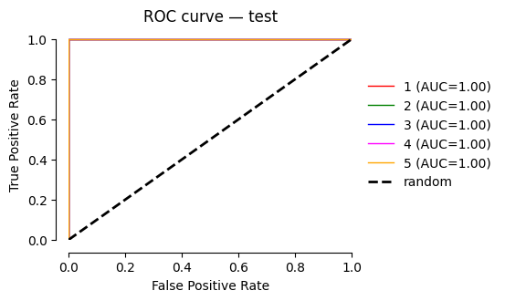

# Main usage

This notebook walks through a complete **customics** workflow on the bundled toy dataset:

1. Load and explore multi-omics data
2. Split into train / validation / test sets
3. Configure and train a `CustOMICS` model
4. Evaluate classification and survival performance
5. Visualise the learned latent space
6. Stratify patients by predicted risk (Kaplan-Meier)
7. Explain model decisions with SHAP values
8. Save and reload a trained model

---

## Architecture at a glance

```
  protein  ──► AE_protein  ──┐
                             │
  gene_exp ──► AE_gene   ──►─┤  Central VAE  ──► Classifier (tumour subtype)
                             │   (latent z)
  methyl   ──► AE_methyl   ──┘               └──► Survival predictor (Cox)
```

**Phase 1** (epochs 0 → `switch`): each source autoencoder is trained
independently; task heads operate on per-source representations.
**Phase 2** (epochs `switch` → end): the central VAE integrates all sources
into a unified latent space used by the task heads.


```python
import matplotlib.pyplot as plt
import torch
from sklearn.model_selection import train_test_split

import customics
from customics import CustOMICS

device = torch.device("cuda" if torch.cuda.is_available() else "cpu")
print(f"Compute device: {device}")
```

    Compute device: cpu


---

## 1. Loading and Exploring the Data

The toy dataset contains **100 patients** with three omics modalities:

| Source     | Features | Description                        |
| ---------- | -------- | ---------------------------------- |
| `protein`  | 160      | Reverse Phase Protein Array (RPPA) |
| `gene_exp` | 131      | RNA-seq gene expression            |
| `methyl`   | 367      | DNA methylation (450K array)       |


```python
omics_df, clinical_df = customics.toy_dataset()
```

`omics_df` is a dict:

- Keys are modality names (here, `'protein'`, `'gene_exp'`, and `'methyl'`)
- Values are DataFrames indexed by **sample ID** (rows = samples, columns = features).


```python
omics_df.keys()
```


    dict_keys(['protein', 'gene_exp', 'methyl'])


```python
omics_df["protein"]
```


<div>
<style scoped>
    .dataframe tbody tr th:only-of-type {
        vertical-align: middle;
    }

    .dataframe tbody tr th {
        vertical-align: top;
    }

    .dataframe thead th {
        text-align: right;
    }
</style>
<table border="1" class="dataframe">
  <thead>
    <tr style="text-align: right;">
      <th>probe</th>
      <th>ACC1</th>
      <th>ACC_pS79</th>
      <th>ACVRL1</th>
      <th>Akt_pS473</th>
      <th>PRAS40_pT246</th>
      <th>Annexin.1</th>
      <th>AR</th>
      <th>A.Raf_pS299</th>
      <th>ASNS</th>
      <th>ATM</th>
      <th>...</th>
      <th>XBP1</th>
      <th>XRCC1</th>
      <th>Ku80</th>
      <th>YAP</th>
      <th>YAP_pS127</th>
      <th>YB.1</th>
      <th>YB.1_pS102</th>
      <th>14.3.3_beta</th>
      <th>14.3.3_epsilon</th>
      <th>14.3.3_zeta</th>
    </tr>
  </thead>
  <tbody>
    <tr>
      <th>subject1</th>
      <td>-0.528421</td>
      <td>-0.826949</td>
      <td>2.465380</td>
      <td>0.118108</td>
      <td>2.682673</td>
      <td>-0.473918</td>
      <td>2.692947</td>
      <td>0.392130</td>
      <td>-1.458304</td>
      <td>-0.518608</td>
      <td>...</td>
      <td>2.365702</td>
      <td>-0.115504</td>
      <td>2.125662</td>
      <td>0.198529</td>
      <td>0.263075</td>
      <td>2.035369</td>
      <td>3.276020</td>
      <td>-0.164232</td>
      <td>2.240264</td>
      <td>0.390613</td>
    </tr>
    <tr>
      <th>subject2</th>
      <td>-0.804377</td>
      <td>-0.858630</td>
      <td>2.679618</td>
      <td>1.163897</td>
      <td>2.789568</td>
      <td>0.326823</td>
      <td>3.703054</td>
      <td>-0.207030</td>
      <td>-0.567368</td>
      <td>-1.447359</td>
      <td>...</td>
      <td>2.369684</td>
      <td>-0.250648</td>
      <td>2.028639</td>
      <td>0.294427</td>
      <td>0.087710</td>
      <td>2.748533</td>
      <td>2.655492</td>
      <td>-0.020322</td>
      <td>2.584052</td>
      <td>1.083867</td>
    </tr>
    <tr>
      <th>subject3</th>
      <td>0.596001</td>
      <td>0.175652</td>
      <td>2.782368</td>
      <td>-1.550062</td>
      <td>2.136330</td>
      <td>-0.729363</td>
      <td>3.987616</td>
      <td>-0.065740</td>
      <td>0.225819</td>
      <td>0.321197</td>
      <td>...</td>
      <td>2.912468</td>
      <td>0.235292</td>
      <td>3.102378</td>
      <td>0.717648</td>
      <td>0.118142</td>
      <td>2.608048</td>
      <td>1.894032</td>
      <td>0.423970</td>
      <td>2.470960</td>
      <td>0.355451</td>
    </tr>
    <tr>
      <th>subject4</th>
      <td>2.306769</td>
      <td>2.387911</td>
      <td>2.152993</td>
      <td>0.175379</td>
      <td>-0.243862</td>
      <td>0.206090</td>
      <td>3.851968</td>
      <td>-0.347185</td>
      <td>1.595250</td>
      <td>2.998184</td>
      <td>...</td>
      <td>0.019668</td>
      <td>2.319597</td>
      <td>0.211079</td>
      <td>0.178415</td>
      <td>0.312633</td>
      <td>-0.205992</td>
      <td>0.151597</td>
      <td>2.289823</td>
      <td>0.153826</td>
      <td>-0.634842</td>
    </tr>
    <tr>
      <th>subject5</th>
      <td>-0.948945</td>
      <td>-0.640623</td>
      <td>2.242055</td>
      <td>0.829983</td>
      <td>2.732090</td>
      <td>-0.218177</td>
      <td>2.376110</td>
      <td>-0.510938</td>
      <td>-1.030711</td>
      <td>-0.125802</td>
      <td>...</td>
      <td>2.169958</td>
      <td>-0.044484</td>
      <td>2.905596</td>
      <td>0.539468</td>
      <td>0.338059</td>
      <td>2.257715</td>
      <td>2.718098</td>
      <td>-0.190475</td>
      <td>2.523407</td>
      <td>0.445861</td>
    </tr>
    <tr>
      <th>...</th>
      <td>...</td>
      <td>...</td>
      <td>...</td>
      <td>...</td>
      <td>...</td>
      <td>...</td>
      <td>...</td>
      <td>...</td>
      <td>...</td>
      <td>...</td>
      <td>...</td>
      <td>...</td>
      <td>...</td>
      <td>...</td>
      <td>...</td>
      <td>...</td>
      <td>...</td>
      <td>...</td>
      <td>...</td>
      <td>...</td>
      <td>...</td>
    </tr>
    <tr>
      <th>subject96</th>
      <td>-0.981248</td>
      <td>-0.742083</td>
      <td>2.527974</td>
      <td>2.460686</td>
      <td>2.390742</td>
      <td>2.116470</td>
      <td>0.837409</td>
      <td>-0.025155</td>
      <td>-1.101259</td>
      <td>-0.367316</td>
      <td>...</td>
      <td>2.604496</td>
      <td>1.630534</td>
      <td>-0.311148</td>
      <td>0.234731</td>
      <td>1.039191</td>
      <td>2.862392</td>
      <td>2.740933</td>
      <td>2.531392</td>
      <td>0.050429</td>
      <td>0.472795</td>
    </tr>
    <tr>
      <th>subject97</th>
      <td>0.536663</td>
      <td>0.060382</td>
      <td>0.458927</td>
      <td>-0.383216</td>
      <td>2.378299</td>
      <td>0.756384</td>
      <td>4.229011</td>
      <td>2.757901</td>
      <td>-0.751035</td>
      <td>1.863307</td>
      <td>...</td>
      <td>-0.084031</td>
      <td>2.216205</td>
      <td>0.362061</td>
      <td>2.739422</td>
      <td>2.292162</td>
      <td>-0.643265</td>
      <td>-0.223000</td>
      <td>2.508272</td>
      <td>3.067408</td>
      <td>2.912263</td>
    </tr>
    <tr>
      <th>subject98</th>
      <td>2.628799</td>
      <td>2.711571</td>
      <td>2.142075</td>
      <td>0.352148</td>
      <td>0.197317</td>
      <td>-0.931261</td>
      <td>4.508386</td>
      <td>-0.193342</td>
      <td>2.651727</td>
      <td>0.789640</td>
      <td>...</td>
      <td>-0.234933</td>
      <td>2.689975</td>
      <td>-0.037623</td>
      <td>0.195504</td>
      <td>0.096643</td>
      <td>0.159894</td>
      <td>0.183006</td>
      <td>2.197074</td>
      <td>-0.324651</td>
      <td>-0.060220</td>
    </tr>
    <tr>
      <th>subject99</th>
      <td>-0.059092</td>
      <td>-0.020732</td>
      <td>3.016003</td>
      <td>1.549904</td>
      <td>1.971049</td>
      <td>1.654036</td>
      <td>1.467497</td>
      <td>-0.504267</td>
      <td>-0.116719</td>
      <td>-0.117848</td>
      <td>...</td>
      <td>2.075979</td>
      <td>2.217837</td>
      <td>-0.176108</td>
      <td>0.348526</td>
      <td>-0.243009</td>
      <td>1.958754</td>
      <td>2.193575</td>
      <td>2.565817</td>
      <td>0.311603</td>
      <td>0.121928</td>
    </tr>
    <tr>
      <th>subject100</th>
      <td>1.731216</td>
      <td>1.670435</td>
      <td>2.633373</td>
      <td>0.366491</td>
      <td>2.855960</td>
      <td>1.096609</td>
      <td>3.418500</td>
      <td>-0.062650</td>
      <td>-1.427957</td>
      <td>2.219091</td>
      <td>...</td>
      <td>-0.559502</td>
      <td>0.043594</td>
      <td>2.558502</td>
      <td>3.173615</td>
      <td>3.154849</td>
      <td>-0.119741</td>
      <td>0.350287</td>
      <td>0.005934</td>
      <td>2.707022</td>
      <td>1.160486</td>
    </tr>
  </tbody>
</table>
<p>100 rows × 160 columns</p>
</div>


`clinical_df` is a DataFrame whose index are sample IDs, and contains the following columns:

- an event-indicator (`OS`, 0 = censored, 1 = event)
- a survival-time column (`OS.time`, in days).
- **tumour subtype label** (`cluster.id`, classes 1–5)


```python
clinical_df
```


<div>
<style scoped>
    .dataframe tbody tr th:only-of-type {
        vertical-align: middle;
    }

    .dataframe tbody tr th {
        vertical-align: top;
    }

    .dataframe thead th {
        text-align: right;
    }
</style>
<table border="1" class="dataframe">
  <thead>
    <tr style="text-align: right;">
      <th></th>
      <th>subjects</th>
      <th>cluster.id</th>
      <th>OS</th>
      <th>OS.time</th>
    </tr>
  </thead>
  <tbody>
    <tr>
      <th>subject1</th>
      <td>1</td>
      <td>5</td>
      <td>0</td>
      <td>2531</td>
    </tr>
    <tr>
      <th>subject2</th>
      <td>2</td>
      <td>5</td>
      <td>1</td>
      <td>759</td>
    </tr>
    <tr>
      <th>subject3</th>
      <td>3</td>
      <td>5</td>
      <td>1</td>
      <td>2453</td>
    </tr>
    <tr>
      <th>subject4</th>
      <td>4</td>
      <td>3</td>
      <td>0</td>
      <td>220</td>
    </tr>
    <tr>
      <th>subject5</th>
      <td>5</td>
      <td>5</td>
      <td>0</td>
      <td>2431</td>
    </tr>
    <tr>
      <th>...</th>
      <td>...</td>
      <td>...</td>
      <td>...</td>
      <td>...</td>
    </tr>
    <tr>
      <th>subject96</th>
      <td>96</td>
      <td>2</td>
      <td>0</td>
      <td>445</td>
    </tr>
    <tr>
      <th>subject97</th>
      <td>97</td>
      <td>4</td>
      <td>0</td>
      <td>1159</td>
    </tr>
    <tr>
      <th>subject98</th>
      <td>98</td>
      <td>3</td>
      <td>1</td>
      <td>530</td>
    </tr>
    <tr>
      <th>subject99</th>
      <td>99</td>
      <td>2</td>
      <td>1</td>
      <td>1149</td>
    </tr>
    <tr>
      <th>subject100</th>
      <td>100</td>
      <td>1</td>
      <td>0</td>
      <td>2893</td>
    </tr>
  </tbody>
</table>
<p>100 rows × 4 columns</p>
</div>


We can show a quick summary of our omics and clinical data:


```python
print("Omics sources loaded:")
for name, df in omics_df.items():
    print(f"  {name:10s}  {df.shape[0]:>4d} samples * {df.shape[1]:>4d} features")
print(f"\nClinical data  : {clinical_df.shape[0]} rows * {clinical_df.shape[1]} columns")
```

    Omics sources loaded:
      protein      100 samples *  160 features
      gene_exp     100 samples *  131 features
      methyl       100 samples *  367 features

    Clinical data  : 100 rows * 4 columns


```python
# Class distribution — the label we will train the classifier on.
print("\n=== Label distribution (cluster.id) ===")
counts = clinical_df["cluster.id"].value_counts().sort_index()
print(counts.to_string())

fig, axes = plt.subplots(1, 2, figsize=(12, 4))
counts.plot(kind="bar", ax=axes[0], color="steelblue", edgecolor="white")
axes[0].set_title("Samples per subtype")
axes[0].set_xlabel("Cluster ID (subtype)")
axes[0].set_ylabel("Count")
axes[0].tick_params(axis="x", rotation=0)

clinical_df["OS.time"].hist(bins=20, ax=axes[1], color="coral", edgecolor="white")
axes[1].set_title("Overall survival time distribution")
axes[1].set_xlabel("Days")
plt.tight_layout()
plt.show()
```


    === Label distribution (cluster.id) ===
    cluster.id
    1    35
    2    13
    3    19
    4     8
    5    25


```python
# get_common_samples returns the intersection of index values across all DataFrames.
# This ensures every downstream step uses exactly the same set of sample IDs.
lt_samples = customics.get_common_samples(list(omics_df.values()) + [clinical_df])
print(f"Samples present in ALL sources and clinical data: {len(lt_samples)}")
print(f"First 5 sample IDs: {lt_samples[:5]}")
```

    Samples present in ALL sources and clinical data: 100
    First 5 sample IDs: ['subject1', 'subject10', 'subject100', 'subject11', 'subject12']


---

## 2. Splitting the Data

We split the full cohort into **train / validation / test** sets.
`get_sub_omics_df` applies the same sample selection to all sources simultaneously,
keeping every dictionary in sync.


```python
samples_train, samples_test = train_test_split(lt_samples, test_size=0.20, random_state=42)
samples_train, samples_val = train_test_split(samples_train, test_size=0.15, random_state=42)

print(f"Train : {len(samples_train):>3d} samples")
print(f"Val   : {len(samples_val):>3d} samples")
print(f"Test  : {len(samples_test):>3d} samples")
```

    Train :  68 samples
    Val   :  12 samples
    Test  :  20 samples


```python
# get_sub_omics_df returns a new dict where each DataFrame is filtered to the given samples.
omics_train = customics.get_sub_omics_df(omics_df, samples_train)
omics_val = customics.get_sub_omics_df(omics_df, samples_val)
omics_test = customics.get_sub_omics_df(omics_df, samples_test)

# Record input dimensions per source — used to configure the autoencoders below.
x_dim = {source: df.shape[1] for source, df in omics_df.items()}
print("Feature dimensions per source:", x_dim)
```

    Feature dimensions per source: {'protein': 160, 'gene_exp': 131, 'methyl': 367}


---

## 3. Configuring the Model

`CustOMICS` is configured through five parameter dictionaries.
Each controls one component of the architecture.

### `source_params` — per-source autoencoders

One entry per omics modality. The autoencoder compresses raw features into a
compact `latent_dim`-dimensional representation.

| Key          | Type      | Description                                                        |
| ------------ | --------- | ------------------------------------------------------------------ |
| `input_dim`  | int       | Number of input features (from the data)                           |
| `hidden_dim` | list[int] | Hidden layer sizes (encoder direction; decoder mirrors in reverse) |
| `latent_dim` | int       | Per-source embedding dimension                                     |
| `norm`       | bool      | Use BatchNorm after each FC layer                                  |
| `dropout`    | float     | Dropout probability in [0, 1]                                      |

### `central_params` — central VAE

Receives the concatenation of all per-source embeddings and produces the
shared latent code **z** used by both task heads.

| Key          | Type      | Description                                        |
| ------------ | --------- | -------------------------------------------------- |
| `hidden_dim` | list[int] | Hidden layer sizes                                 |
| `latent_dim` | int       | Dimension of **z** (the integrated representation) |
| `beta`       | float     | Weight of the MMD regularisation term              |
| `norm`       | bool      | BatchNorm in layers                                |
| `dropout`    | float     | Dropout probability                                |

### `classif_params` — classifier head

Maps **z** → tumour subtype probabilities via a small MLP.

| Key             | Type      | Description                                  |
| --------------- | --------- | -------------------------------------------- |
| `n_class`       | int       | Number of output classes                     |
| `lambda`        | float     | Classification loss weight in the total loss |
| `hidden_layers` | list[int] | MLP hidden sizes                             |
| `dropout`       | float     | Dropout probability                          |

### `surv_params` — Cox survival head

Maps **z** → log-hazard score. Set `lambda = 0` to disable.

| Key          | Type      | Description                                           |
| ------------ | --------- | ----------------------------------------------------- |
| `lambda`     | float     | Cox loss weight (`0` = disabled)                      |
| `dims`       | list[int] | Hidden layer sizes (final output size is always 1)    |
| `activation` | str       | Activation name: `"SELU"`, `"ReLU"`, `"LeakyReLU"`, … |
| `l2_reg`     | float     | L2 regularisation on the survival head weights        |
| `norm`       | bool      | BatchNorm in layers                                   |
| `dropout`    | float     | Dropout probability                                   |

### `train_params` — optimiser & phase schedule

| Key      | Type  | Description                                 |
| -------- | ----- | ------------------------------------------- |
| `switch` | int   | Epoch where phase 1 ends and phase 2 begins |
| `lr`     | float | Adam learning rate                          |


```python
# ── Clinical column names ────────────────────────────────────────────────────
label = "cluster.id"  # tumour subtype (1–5)
event = "OS"  # event indicator: 1 = event occurred, 0 = censored
surv_time = "OS.time"  # time-to-event in days
task = "classification"

# ── Training schedule ─────────────────────────────────────────────────────────
batch_size = 32
n_epochs = 30  # 30 epochs is enough for the 100-sample toy dataset

# ── Per-source autoencoder parameters ────────────────────────────────────────
# x_dim is a dict {source_name: n_features}, computed from the data above.
# Using a dict comprehension keeps source_params in sync with x_dim automatically.
source_params = {
    source: {
        "input_dim": x_dim[source],  # auto-filled — do not hardcode
        "hidden_dim": [256, 128],
        "latent_dim": 64,
        "norm": True,
        "dropout": 0.2,
    }
    for source in x_dim
}

# ── Central VAE parameters ───────────────────────────────────────────────────
central_params = {
    "hidden_dim": [256, 128],
    "latent_dim": 64,  # dimension of the shared latent code z
    "norm": True,
    "dropout": 0.2,
    "beta": 1.0,  # MMD regularisation weight
}

# ── Classifier head parameters ───────────────────────────────────────────────
classif_params = {
    "n_class": 5,  # subtypes 1-5
    "lambda": 5.0,  # classification loss weight
    "hidden_layers": [64, 32],
    "dropout": 0.2,
}

# ── Survival head parameters ─────────────────────────────────────────────────
# lambda=0 disables the Cox loss; the survival head is still built but not trained.
# To enable survival, set lambda > 0 and ensure OS / OS.time contain real data.
surv_params = {
    "lambda": 0.0,
    "dims": [32, 16],
    "activation": "SELU",
    "l2_reg": 1e-2,
    "norm": True,
    "dropout": 0.2,
}

# ── Optimiser & phase schedule ───────────────────────────────────────────────
# switch=15 means:
#   epochs 0–14  → Phase 1: source AEs train independently
#   epochs 15–29 → Phase 2: central VAE takes over, heads are jointly optimised
train_params = {"switch": 15, "lr": 1e-3}

print("source_params keys :", list(source_params.keys()))
print("input dimensions   :", {k: v["input_dim"] for k, v in source_params.items()})
print("central latent dim :", central_params["latent_dim"])
print(
    f"training phases    : phase 1 → epochs 0–{train_params['switch'] - 1}, "
    f"phase 2 → epochs {train_params['switch']}–{n_epochs - 1}"
)
```

    source_params keys : ['protein', 'gene_exp', 'methyl']
    input dimensions   : {'protein': 160, 'gene_exp': 131, 'methyl': 367}
    central latent dim : 64
    training phases    : phase 1 → epochs 0–14, phase 2 → epochs 15–29


---

## 4. Building and Training the Model

### Model instantiation

Pass the five config dicts to `CustOMICS`. The model is built immediately but
weights are random until `fit()` is called.


```python
model = CustOMICS(
    source_params=source_params,
    central_params=central_params,
    classif_params=classif_params,
    surv_params=surv_params,
    train_params=train_params,
    device=device,
)
print(f"Total trainable parameters: {model.get_number_parameters():,}")
```

    Total trainable parameters: 790,778


```python
# fit() returns self, so it can be chained.
# omics_val triggers validation loss logging after each epoch.
model.fit(
    omics_train=omics_train,
    clinical_df=clinical_df,
    label=label,
    event=event,
    surv_time=surv_time,
    omics_val=omics_val,
    batch_size=batch_size,
    n_epochs=n_epochs,
    verbose=True,
)
```

    [INFO] (customics.model) Epoch 1/30 | train=28.4917 | val=32.4595
    [INFO] (customics.model) Epoch 2/30 | train=24.1982 | val=30.1953
    [INFO] (customics.model) Epoch 3/30 | train=18.2897 | val=26.9450
    [INFO] (customics.model) Epoch 4/30 | train=16.7007 | val=23.7568
    [INFO] (customics.model) Epoch 5/30 | train=15.2662 | val=20.3442
    [INFO] (customics.model) Epoch 6/30 | train=15.6759 | val=16.3787
    [INFO] (customics.model) Epoch 7/30 | train=13.1489 | val=16.1814
    [INFO] (customics.model) Epoch 8/30 | train=11.5617 | val=16.1389
    [INFO] (customics.model) Epoch 9/30 | train=10.8479 | val=14.5620
    [INFO] (customics.model) Epoch 10/30 | train=10.2700 | val=14.7346
    [INFO] (customics.model) Epoch 11/30 | train=13.2465 | val=13.7110
    [INFO] (customics.model) Epoch 12/30 | train=8.7209 | val=13.5023
    [INFO] (customics.model) Epoch 13/30 | train=10.4842 | val=11.0960
    [INFO] (customics.model) Epoch 14/30 | train=9.0919 | val=10.6878
    [INFO] (customics.model) Epoch 15/30 | train=8.5125 | val=10.5673
    [INFO] (customics.model) Epoch 16/30 | train=7.1673 | val=8.5255
    [INFO] (customics.model) Epoch 17/30 | train=5.6954 | val=7.2609
    [INFO] (customics.model) Epoch 18/30 | train=3.7520 | val=6.6319
    [INFO] (customics.model) Epoch 19/30 | train=3.9967 | val=6.2724
    [INFO] (customics.model) Epoch 20/30 | train=6.0441 | val=5.0781
    [INFO] (customics.model) Epoch 21/30 | train=6.8372 | val=4.5348
    [INFO] (customics.model) Epoch 22/30 | train=4.3612 | val=4.4146
    [INFO] (customics.model) Epoch 23/30 | train=3.8013 | val=4.3407
    [INFO] (customics.model) Epoch 24/30 | train=3.9107 | val=4.2530
    [INFO] (customics.model) Epoch 25/30 | train=3.2288 | val=4.6227
    [INFO] (customics.model) Epoch 26/30 | train=3.0911 | val=4.8295
    [INFO] (customics.model) Epoch 27/30 | train=3.6982 | val=4.6160
    [INFO] (customics.model) Epoch 28/30 | train=3.1297 | val=4.7703
    [INFO] (customics.model) Epoch 29/30 | train=4.2564 | val=4.7967
    [INFO] (customics.model) Epoch 30/30 | train=5.3091 | val=4.3446


    CustOMICS(
      (autoencoders): ModuleList(
        (0): AutoEncoder(
          (encoder): Encoder(
            (net): Sequential(
              (InputLayer): FullyConnectedLayer(
                (fc_block): Sequential(
                  (0): Linear(in_features=160, out_features=256, bias=True)
                  (1): BatchNorm1d(256, eps=1e-05, momentum=0.1, affine=True, track_running_stats=True)
                  (2): Dropout(p=0.2, inplace=False)
                  (3): LeakyReLU(negative_slope=0.2, inplace=True)
                )
              )
              (Layer1): FullyConnectedLayer(
                (fc_block): Sequential(
                  (0): Linear(in_features=256, out_features=128, bias=True)
                  (1): BatchNorm1d(128, eps=1e-05, momentum=0.1, affine=True, track_running_stats=True)
                  (2): LeakyReLU(negative_slope=0.2, inplace=True)
                )
              )
              (OutputLayer): FullyConnectedLayer(
                (fc_block): Sequential(
                  (0): Linear(in_features=128, out_features=64, bias=True)
                )
              )
            )
          )
          (decoder): Decoder(
            (net): Sequential(
              (InputLayer): FullyConnectedLayer(
                (fc_block): Sequential(
                  (0): Linear(in_features=64, out_features=128, bias=True)
                  (1): BatchNorm1d(128, eps=1e-05, momentum=0.1, affine=True, track_running_stats=True)
                  (2): Dropout(p=0.2, inplace=False)
                  (3): LeakyReLU(negative_slope=0.2, inplace=True)
                )
              )
              (Layer1): FullyConnectedLayer(
                (fc_block): Sequential(
                  (0): Linear(in_features=128, out_features=256, bias=True)
                  (1): BatchNorm1d(256, eps=1e-05, momentum=0.1, affine=True, track_running_stats=True)
                  (2): LeakyReLU(negative_slope=0.2, inplace=True)
                )
              )
              (OutputLayer): FullyConnectedLayer(
                (fc_block): Sequential(
                  (0): Linear(in_features=256, out_features=160, bias=True)
                )
              )
            )
          )
        )
        (1): AutoEncoder(
          (encoder): Encoder(
            (net): Sequential(
              (InputLayer): FullyConnectedLayer(
                (fc_block): Sequential(
                  (0): Linear(in_features=131, out_features=256, bias=True)
                  (1): BatchNorm1d(256, eps=1e-05, momentum=0.1, affine=True, track_running_stats=True)
                  (2): Dropout(p=0.2, inplace=False)
                  (3): LeakyReLU(negative_slope=0.2, inplace=True)
                )
              )
              (Layer1): FullyConnectedLayer(
                (fc_block): Sequential(
                  (0): Linear(in_features=256, out_features=128, bias=True)
                  (1): BatchNorm1d(128, eps=1e-05, momentum=0.1, affine=True, track_running_stats=True)
                  (2): LeakyReLU(negative_slope=0.2, inplace=True)
                )
              )
              (OutputLayer): FullyConnectedLayer(
                (fc_block): Sequential(
                  (0): Linear(in_features=128, out_features=64, bias=True)
                )
              )
            )
          )
          (decoder): Decoder(
            (net): Sequential(
              (InputLayer): FullyConnectedLayer(
                (fc_block): Sequential(
                  (0): Linear(in_features=64, out_features=128, bias=True)
                  (1): BatchNorm1d(128, eps=1e-05, momentum=0.1, affine=True, track_running_stats=True)
                  (2): Dropout(p=0.2, inplace=False)
                  (3): LeakyReLU(negative_slope=0.2, inplace=True)
                )
              )
              (Layer1): FullyConnectedLayer(
                (fc_block): Sequential(
                  (0): Linear(in_features=128, out_features=256, bias=True)
                  (1): BatchNorm1d(256, eps=1e-05, momentum=0.1, affine=True, track_running_stats=True)
                  (2): LeakyReLU(negative_slope=0.2, inplace=True)
                )
              )
              (OutputLayer): FullyConnectedLayer(
                (fc_block): Sequential(
                  (0): Linear(in_features=256, out_features=131, bias=True)
                )
              )
            )
          )
        )
        (2): AutoEncoder(
          (encoder): Encoder(
            (net): Sequential(
              (InputLayer): FullyConnectedLayer(
                (fc_block): Sequential(
                  (0): Linear(in_features=367, out_features=256, bias=True)
                  (1): BatchNorm1d(256, eps=1e-05, momentum=0.1, affine=True, track_running_stats=True)
                  (2): Dropout(p=0.2, inplace=False)
                  (3): LeakyReLU(negative_slope=0.2, inplace=True)
                )
              )
              (Layer1): FullyConnectedLayer(
                (fc_block): Sequential(
                  (0): Linear(in_features=256, out_features=128, bias=True)
                  (1): BatchNorm1d(128, eps=1e-05, momentum=0.1, affine=True, track_running_stats=True)
                  (2): LeakyReLU(negative_slope=0.2, inplace=True)
                )
              )
              (OutputLayer): FullyConnectedLayer(
                (fc_block): Sequential(
                  (0): Linear(in_features=128, out_features=64, bias=True)
                )
              )
            )
          )
          (decoder): Decoder(
            (net): Sequential(
              (InputLayer): FullyConnectedLayer(
                (fc_block): Sequential(
                  (0): Linear(in_features=64, out_features=128, bias=True)
                  (1): BatchNorm1d(128, eps=1e-05, momentum=0.1, affine=True, track_running_stats=True)
                  (2): Dropout(p=0.2, inplace=False)
                  (3): LeakyReLU(negative_slope=0.2, inplace=True)
                )
              )
              (Layer1): FullyConnectedLayer(
                (fc_block): Sequential(
                  (0): Linear(in_features=128, out_features=256, bias=True)
                  (1): BatchNorm1d(256, eps=1e-05, momentum=0.1, affine=True, track_running_stats=True)
                  (2): LeakyReLU(negative_slope=0.2, inplace=True)
                )
              )
              (OutputLayer): FullyConnectedLayer(
                (fc_block): Sequential(
                  (0): Linear(in_features=256, out_features=367, bias=True)
                )
              )
            )
          )
        )
      )
      (central_layer): VAE(
        (encoder): ProbabilisticEncoder(
          (net): Sequential(
            (InputLayer): FullyConnectedLayer(
              (fc_block): Sequential(
                (0): Linear(in_features=192, out_features=256, bias=True)
                (1): BatchNorm1d(256, eps=1e-05, momentum=0.1, affine=True, track_running_stats=True)
                (2): Dropout(p=0.2, inplace=False)
                (3): LeakyReLU(negative_slope=0.2, inplace=True)
              )
            )
            (Layer1): FullyConnectedLayer(
              (fc_block): Sequential(
                (0): Linear(in_features=256, out_features=128, bias=True)
                (1): BatchNorm1d(128, eps=1e-05, momentum=0.1, affine=True, track_running_stats=True)
                (2): LeakyReLU(negative_slope=0.2, inplace=True)
              )
            )
          )
          (mean_layer): FullyConnectedLayer(
            (fc_block): Sequential(
              (0): Linear(in_features=128, out_features=64, bias=True)
            )
          )
          (log_var_layer): FullyConnectedLayer(
            (fc_block): Sequential(
              (0): Linear(in_features=128, out_features=64, bias=True)
            )
          )
        )
        (decoder): ProbabilisticDecoder(
          (net): Sequential(
            (InputLayer): FullyConnectedLayer(
              (fc_block): Sequential(
                (0): Linear(in_features=64, out_features=128, bias=True)
                (1): BatchNorm1d(128, eps=1e-05, momentum=0.1, affine=True, track_running_stats=True)
                (2): Dropout(p=0.2, inplace=False)
                (3): LeakyReLU(negative_slope=0.2, inplace=True)
              )
            )
            (Layer1): FullyConnectedLayer(
              (fc_block): Sequential(
                (0): Linear(in_features=128, out_features=256, bias=True)
                (1): BatchNorm1d(256, eps=1e-05, momentum=0.1, affine=True, track_running_stats=True)
                (2): LeakyReLU(negative_slope=0.2, inplace=True)
              )
            )
            (OutputLayer): FullyConnectedLayer(
              (fc_block): Sequential(
                (0): Linear(in_features=256, out_features=192, bias=True)
              )
            )
          )
        )
      )
      (classifier): MultiClassifier(
        (net): Sequential(
          (InputLayer): FullyConnectedLayer(
            (fc_block): Sequential(
              (0): Linear(in_features=64, out_features=64, bias=True)
              (1): BatchNorm1d(64, eps=1e-05, momentum=0.1, affine=True, track_running_stats=True)
              (2): Dropout(p=0.2, inplace=False)
              (3): LeakyReLU(negative_slope=0.2, inplace=True)
            )
          )
          (Layer1): FullyConnectedLayer(
            (fc_block): Sequential(
              (0): Linear(in_features=64, out_features=32, bias=True)
              (1): BatchNorm1d(32, eps=1e-05, momentum=0.1, affine=True, track_running_stats=True)
              (2): Dropout(p=0.2, inplace=False)
              (3): LeakyReLU(negative_slope=0.2, inplace=True)
            )
          )
          (OutputLayer): FullyConnectedLayer(
            (fc_block): Sequential(
              (0): Linear(in_features=32, out_features=5, bias=True)
            )
          )
        )
      )
      (survival_predictor): SurvivalNet(
        (model): Sequential(
          (0): Linear(in_features=64, out_features=32, bias=True)
          (1): BatchNorm1d(32, eps=1e-05, momentum=0.1, affine=True, track_running_stats=True)
          (2): SELU()
          (3): Dropout(p=0.2, inplace=False)
          (4): Linear(in_features=32, out_features=16, bias=True)
          (5): BatchNorm1d(16, eps=1e-05, momentum=0.1, affine=True, track_running_stats=True)
          (6): SELU()
          (7): Dropout(p=0.2, inplace=False)
          (8): Linear(in_features=16, out_features=1, bias=True)
          (9): BatchNorm1d(1, eps=1e-05, momentum=0.1, affine=True, track_running_stats=True)
          (10): SELU()
        )
      )
    )


```python
# Plot the train/validation loss curves to check for overfitting.
# The vertical dashed line marks the phase 1 → phase 2 transition.
model.plot_loss()
```


---

## 5. Evaluating the Model

`evaluate()` runs inference on the held-out **test set** and returns a metrics dict.

- **Classification** (`task="classification"`): accuracy, macro F1, weighted F1,
  and per-class ROC-AUC.
- **Survival** (`task="survival"`): concordance index (C-index) via the Cox head.

> Set `plot_roc=True` to overlay per-class ROC curves on a single figure.


```python
# Evaluate tumour-subtype classification on the test split.
metrics = model.evaluate(
    omics_test=omics_test,
    clinical_df=clinical_df,
    label=label,
    event=event,
    surv_time=surv_time,
    task="classification",
    batch_size=1024,
    plot_roc=True,
)

print("\n── Classification metrics on the test set ──")
for k, v in metrics.items():
    print(f"  {k:<25s}: {v:.4f}" if isinstance(v, float) else f"  {k}: {v}")
```


    ── Classification metrics on the test set ──
      Accuracy                 : 1.0000
      F1-score                 : 1.0000
      Precision                : 1.0000
      Recall                   : 1.0000
      AUC                      : 1.0000


```python
# Evaluate the Cox survival head on the test split.
# With synthetic OS/OS.time the C-index will be ~0.5 (random), which is expected.
# Replace OS/OS.time with real data to obtain meaningful survival performance.
surv_metrics = model.evaluate(
    omics_test=omics_test,
    clinical_df=clinical_df,
    label=label,
    event=event,
    surv_time=surv_time,
    task="survival",
    batch_size=1024,
)

print("\n── Survival metrics on the test set ──")
print("C-index :", surv_metrics)
```


    ── Survival metrics on the test set ──
    C-index : 0.48936170212765956


---

## 6. Visualising the Latent Space

`get_latent_representation()` encodes every sample in `omics_df` through the
trained central VAE and returns a NumPy array of shape `(n_samples, latent_dim)`.

`plot_representation()` runs t-SNE on that array and colours each point by the
clinical label — a quick sanity check that the model has learned subtype-discriminative
features.


```python
from pathlib import Path

# Get the latent embedding for ALL samples (train + val + test combined).
z = model.get_latent_representation(omics_df)
print(f"Latent space shape: {z.shape}  (n_samples × latent_dim)")


# Create the results directory if it doesn't exist yet.
RESULTS_DIR = Path("results")
RESULTS_DIR.mkdir(exist_ok=True)

model.plot_representation(
    omics_df=omics_df,
    clinical_df=clinical_df,
    label=label,
    filename=RESULTS_DIR / "latent_representation",
    title="t-SNE of the integrated latent space",
    show=True,
)
```

    Latent space shape: (100, 64)  (n_samples × latent_dim)





    <Figure size 640x480 with 0 Axes>


---

## 7. Survival Risk Stratification

`stratify()` uses the Cox head to assign each sample a risk score, then splits
the cohort into high-risk / low-risk groups at the median score and draws a
Kaplan-Meier curve.

> **Note:** with synthetic survival data the curves will overlap.
> This section shows the API; meaningful separation requires real OS/OS.time.


```python
model.stratify(
    omics_df=omics_df,
    clinical_df=clinical_df,
    event=event,
    surv_time=surv_time,
    save_path="results/km_stratification",
    show=True,
)
```


---

## 8. Feature Importance with SHAP

`explain()` uses `shap.DeepExplainer` to compute feature-attribution values for
one omics source and one tumour subtype.

**Parameters:**

| Parameter     | Description                                                           |
| ------------- | --------------------------------------------------------------------- |
| `sample_id`   | List of sample IDs to explain                                         |
| `omics_df`    | Full omics dictionary                                                 |
| `clinical_df` | Clinical metadata                                                     |
| `source`      | Which omics source to explain (`"gene_exp"`, `"protein"`, `"methyl"`) |
| `subtype`     | Integer label of the class to explain (1-based here)                  |
| `label`       | Column in `clinical_df` containing the class labels                   |
| `device`      | `"cpu"` or `"cuda"`                                                   |
| `show`        | Display the SHAP summary plot inline                                  |

The bar plot shows the **mean absolute SHAP value** for each feature — higher
means more influential for predicting the chosen subtype.


```python
# Feature importance for gene expression → subtype 1
model.explain(
    sample_id=lt_samples,
    omics_df=omics_df,
    clinical_df=clinical_df,
    source="gene_exp",
    subtype=1,
    label=label,
    device="cpu",
    show=True,
)
```


```python
# Feature importance for protein expression → subtype 1
model.explain(
    sample_id=lt_samples,
    omics_df=omics_df,
    clinical_df=clinical_df,
    source="protein",
    subtype=1,
    label=label,
    device="cpu",
    show=True,
)
```


```python
# Feature importance for DNA methylation → subtype 1
model.explain(
    sample_id=lt_samples,
    omics_df=omics_df,
    clinical_df=clinical_df,
    source="methyl",
    subtype=1,
    label=label,
    device="cpu",
    show=True,
)
```

---

## 9. Saving and Reloading the Model

`CustOMICS` uses PyTorch's standard `state_dict` / `load_state_dict` mechanism.
The helper methods `save()` and `load()` wrap this pattern so you don't need to
worry about the architecture parameters — `load()` reconstructs the full model
from the checkpoint.

> **Best practice:** save after the final training run so you can reproduce
> predictions without retraining.


```python
checkpoint_path = RESULTS_DIR / "customics_model.pt"

# save() stores both the architecture config and the weight tensors.
model.save(checkpoint_path)
print(f"Model saved to: {checkpoint_path}")
```

    [INFO] (customics.model) Model saved to results/customics_model.pt


    Model saved to: results/customics_model.pt


```python
# load() is a class method — it rebuilds the model from the checkpoint file.
loaded_model = CustOMICS.load(checkpoint_path, device=device)
print(f"Model loaded from: {checkpoint_path}")
print(f"Parameters in loaded model: {loaded_model.get_number_parameters():,}")
```

    [INFO] (customics.model) Model loaded from results/customics_model.pt


    Model loaded from: results/customics_model.pt
    Parameters in loaded model: 790,778


```python
# Sanity-check: predictions from the reloaded model should match the originals.
metrics_reloaded = loaded_model.evaluate(
    omics_test=omics_test,
    clinical_df=clinical_df,
    label=label,
    event=event,
    surv_time=surv_time,
    task="classification",
    batch_size=1024,
    plot_roc=False,
)
print("\n── Reloaded model — classification metrics ──")
for k, v in metrics_reloaded.items():
    print(f"  {k:<25s}: {v:.4f}" if isinstance(v, float) else f"  {k}: {v}")
```


    ── Reloaded model — classification metrics ──
      Accuracy                 : 1.0000
      F1-score                 : 1.0000
      Precision                : 1.0000
      Recall                   : 1.0000
      AUC                      : 1.0000
